# Práctica 1: URDF

| Código | Description |
| ------:| ----------- |
| ***Asignatura*** | ***Práctica*** | 
| **Robótica-2025-1**  | Práctica: *01* |

## Contenido

- [Objetivo](#objetivo)
- [Introducción](#introduccion)
- [Previo](#previo)
- [Desarrollo](#desarrollo)
- [Resultados](#resultados)
- [Conclusión](#conclusión)
- [Autor](#autor)
- [Referencias](#referencias)

## Objetivo

El objetivo de esta práctica es que el alumno comprenda, interprete y modifique la información básica de los formatos de Universal Robot Description File (URDF).

### Metas 

- Que el alumno comprende el orden de los archivos que comprenden los espacios de trabajo (ws) y los paquetes que los integran en ROS 2.
- Que el alumno comprenda la estructura básica de un archivo URDF.
- Que el alumno sea capaz de mofificar la información básica de los archivos URDF para modificar la descripción de un robot serial.
- Que el alumno conozca los elementos de los archivos \"launch\" en ROS 2.
- Que el alumno sea capaz de vizualizar un robot descrito en un archivo URDF mediante la aplicación de RVIZ.
 
### Contribución al perfil del egresado

La siguiente práctica contribuye en los siguientes puntos al perfil del egresado:

#### Aptitudes y habilidades

- Para modelar, simular e interpretar el comportamiento de los sistemas mecatrónicos.
- Para desarrollar, operar y mantener procesos productivos que impliquen la transformación de materia, energía e información.
- Para diseñar, construir, operar y mantener los sistemas mecatrónicos y sus componentes.

#### Actitudes

- Ser creativo e innovador.
- Tener confianza en su preparación académica.
- Comprometido con su actualización, superación y competencia profesional.

#### De tipo social

- Promover el cambio en la mentalidad frente a la competitividad internacional.

## Introducción

La robótica ha avanzado significativamente y se ha implementado el avance de la tecnología, con ello, cada vez se ve la complejidad en el diseño y la operación de los robots, el cual, contar con herramientas que faciliten el diseño y sobre todo la simulación de sus componentes se ha hecho indispensable. Con ayuda de Universal Robot Description File (URDF) se logra definir la geometría, cinemática y dinámica del robot, de una forma más clara y precisa, y con ello determinar las trayectorias y posiciones de los enlaces y juntas. Por otro lado, con RVIZ se puede observar y analizar en tiempo real el comportamiento del robot y su entorno y con ello validar el diseño antes de implementarlo físicamente. [^2] [^4]

## Previo

***1. Definición de URDF***

El Unified Robot Description Format (URDF) es un formato de archivo que es basado en XML el cual se utiliza para describir la estructura y las propiedades de los robots en el sistema Robot Operating System (ROS). URDF permite definir la geometría, la cinemática y las características dinámicas de un robot, lo que facilita la simulación y el control de este. Además, incluye información sobre los enlaces, juntas, colisiones y visualización de los componentes del robot. [^1]

***2. Tipos de juntas definidas en URDF***

En URDF, se pueden definir varios tipos de juntas, las cuales son:
- Revolute: Permite rotación alrededor de un eje.
- Prismatic: Permite desplazamiento lineal a lo largo de un eje.
- Fixed: No permite ningún movimiento entre los enlaces, se utiliza para conectar partes fijas del robot.
- Continuous: Permite rotación continua alrededor de un eje, se usa en rotación sin límite, por ejemplo, en ruedas. [^2]

***3. Definición de elementos "primitivos" en ROS***

Se refieren a las entidades básicas que se pueden utilizar para definir un robot, estas pueden ser:
- Links: Estas representan las partes rígidas del robot, es importante mencionar que cada enlace tiene una forma geométrica.
- Joints: Estas conectan dos enlaces y definen cómo se mueven uno en relación con el otro.
- Sensors: Son dispositivos que permiten al robot percibir su entorno, por ejemplo, las cámaras.
- Actuators: Son elementos que permiten que el robot realice acciones, estos pueden ser motores o servos. [^2]

***4. Nodo y tópico en ROS 2***

- Nodo: Es una instancia de un proceso que puede ejecutar código y realizar tareas específicas. Los nodos pueden comunicarse entre sí, permitiendo la modularidad y la reutilización del código.
- Tópico: Es un canal de comunicación a través del cual los nodos pueden intercambiar mensajes. Los nodos publican información en tópicos o se suscriben a ellos para recibir datos, esto permite la comunicación asincrónica entre diferentes partes del sistema. [^3]

***5. ¿Qué es RVIZ?***

RVIZ (Robot Visualization) es una herramienta de visualización en ROS que permite al usuario observar y analizar el estado del robot y su entorno. Se pueden visualizar enlaces, juntas, sensores y otros elementos en tiempo real. Es especialmente útil para depurar, simular y validar el comportamiento del robot antes de implementarlo en el mundo real. [^4]

## Desarrollo

Primeramente lo que se hizo fue formar paquetes de trabajo dentro de ROS2Dev, nombrando a la carpeta robot_2025_ws, dentro de esta se creó un source nombrado src, el cual en esta a su vez se creó una carpeta llamada practica1_description. En este nivel se crearon paquetes de trabajo, los cuales fueron launch, rviz, src y urdf, los cuales van a ser ocupados más adelante para poder realizar la codificación de nuestros eslabones.
Para visualizar lo que se hizo anteriormente y poder iniciar con la codificación de los eslabones, se deberá ingresar a visual studio code, para ello se tendrá se teclear los comandos mostrados en la *Figura 1* en la máquina virtual.

  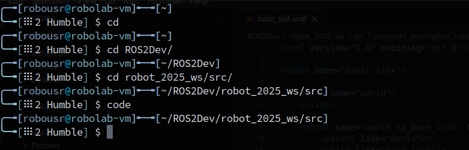

Figura 1. Código para ingresar a VS code.

Una vez que nos abra visual studio code, debemos de tener una interfaz como la que se muestra en la *Figura 2*, la cual nos muestra todas las carpetas con las que contamos, estas son mostradas en el lado izquierdo de la pantalla, aqui mismo vemos que tenemos nuestra carpeta de practica1_description, y recordando, dentro de esta se deben encontrar los paquetes, launch, rviz, src y urdf.

  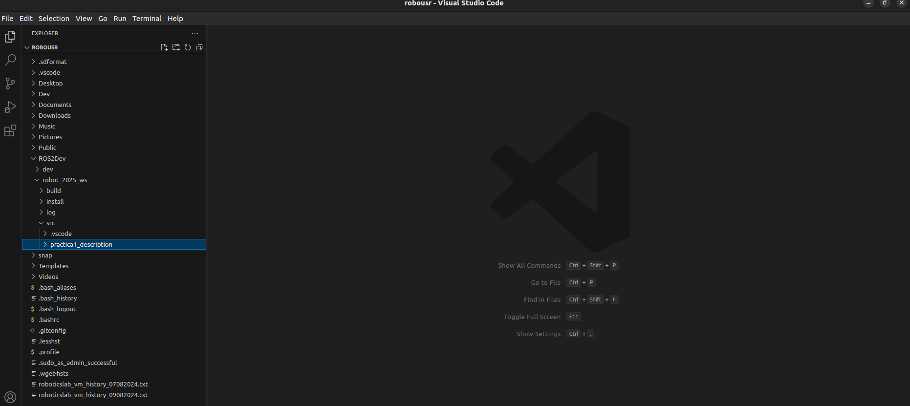

Figura 2. Interface de visualización de VS code.

A continuación se aprecia en la *Figura 3* una imagen mejor de como es que se encuentran nuestros paquetes de trabajo, una vez teniendo estos paquetes, dentro de la de urdf, procedemos a crear un nuevo documento el cual es llamado basic_link.urdf, es importante que le agreguemos la extensión .urdf, de lo contrario no nos agarraria, dentro de este documento, es donde se procederá a realizar la codificación de nuestros eslabones.

  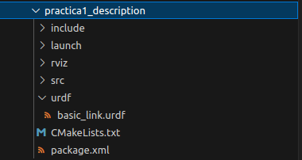

Figura 3. Visualización del paquete de trabajo de la práctica 1.

Como se menciono, en el documento basic_link.urdf, se realiza la codificación, para lo cual en la *Figura 4* se presenta la primer parte del codigo para un eslabón, el cual en esta parte nos presenta en primer lugar el nombre que se le dio al robot, la descripción de la parte visual de la base del eslabón, la cual incluye la posición y origen de la base del eslabón, la definición de la geometria del eslabón, el color del eslabón, y la parte de collision, la cual describe geometria y posición y origen.

  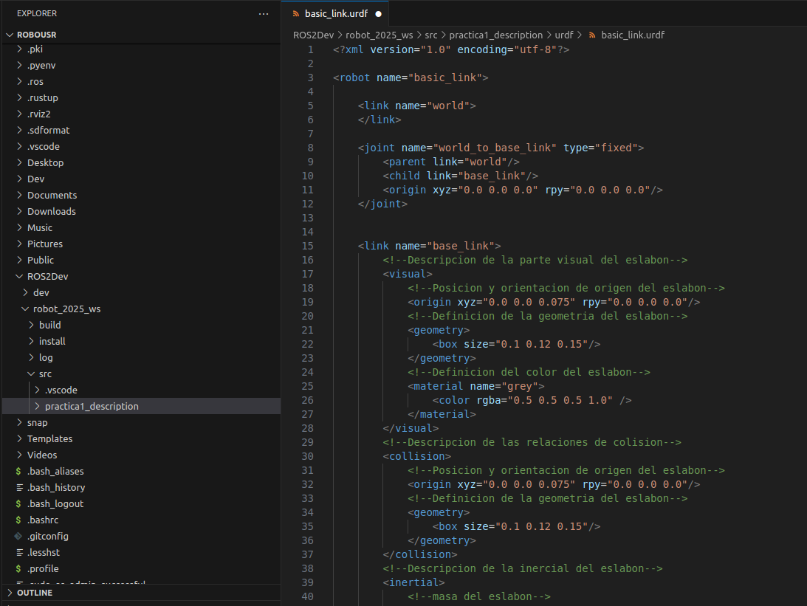

Figura 4. Definición de parámetros de la base del eslabón.

Para este caso, ya se muestra la parte del eslabón, la cual presenta la descripción visual del mismo, la posición y origen del eslabón, además de la geometria y el color, agregado a esto se tiene la parte de collision, la cual es la parte en la cual se va a encontrar respecto a la base, cabe mencionar que este eslabón lleva por nombre link_1, todo esto se puede visualizar en la *Figura 5*.

  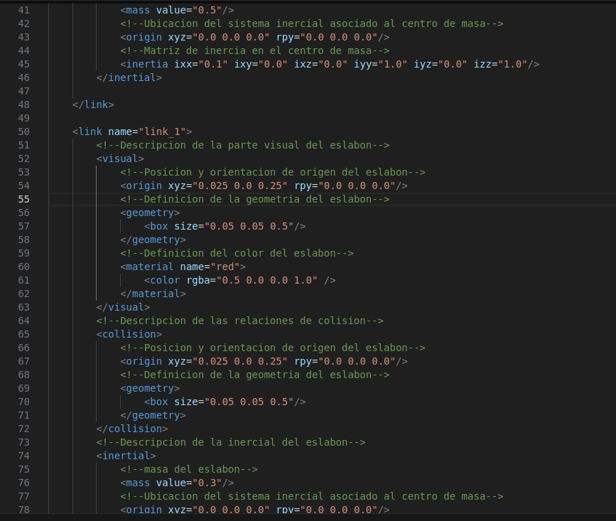

Figura 5. Definición de la parte visual del eslabón y de collision.

Llegado a este punto se presenta la base del eslabón y las caracteristicas asignadas al mismo, como lo son el eje en el que se va a encontrar, los limites de lower, upper, velocity y effort. Además en esta parte se muestra la definición del Gazebo, para una mejor visualización se tiene la *Figura 6*.

  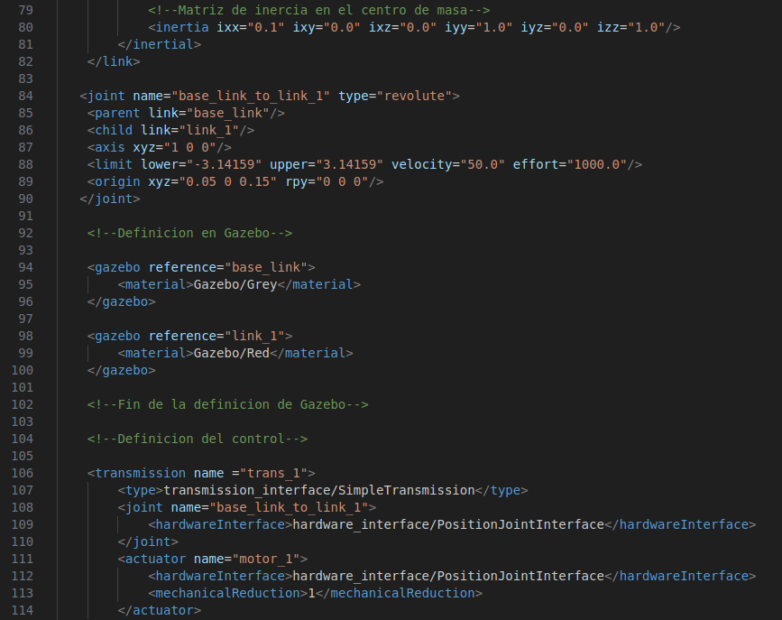

Figura 6. Definición del gazebo.

Para concluir la codificación del primer eslabón, se muestra la definición del control, el cual se emplea un actuador, y se muestra el nombre que se le asigno, para ello, se muestra en la *Figura 7*.

  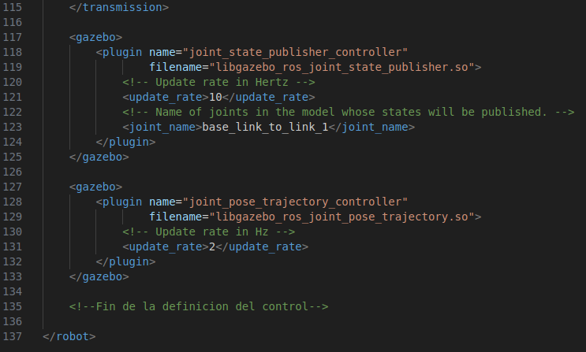

Figura 7. Definición del control.

En este punto se comienza la codificación para dos eslabones, al igual que en los pasos anteriores, primeramente se definen los parámetros para la base de los eslabones, definiendo geometria, color y posición, además de el tamaño, para esta primer parte del código se presenta en la *Figura 8*.

  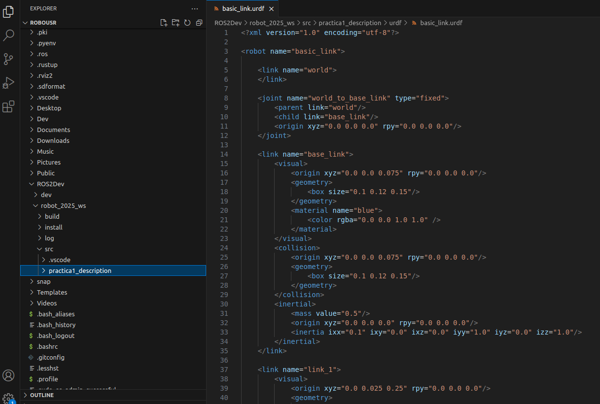

Figura 8. Configuración de la base del eslabón.

En la *Figura 9* se presenta la descripción para el primer y segundo eslabón, definiendo parámetros de geometria, color, posición y tamaño.

  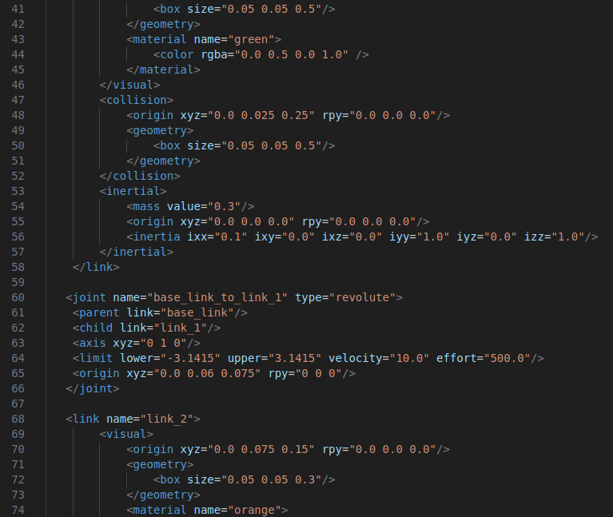

Figura 9. Configuración del primer y segundo eslabón.

Finalmente se tiene en la *Figura 10* la parte de collision, la cual presenta la posición y como los eslabones van a estar acoplados uno del otro, además de definir el eje en el que se encontrará el robot y los limites, como lower, upper, velocity y effort.

  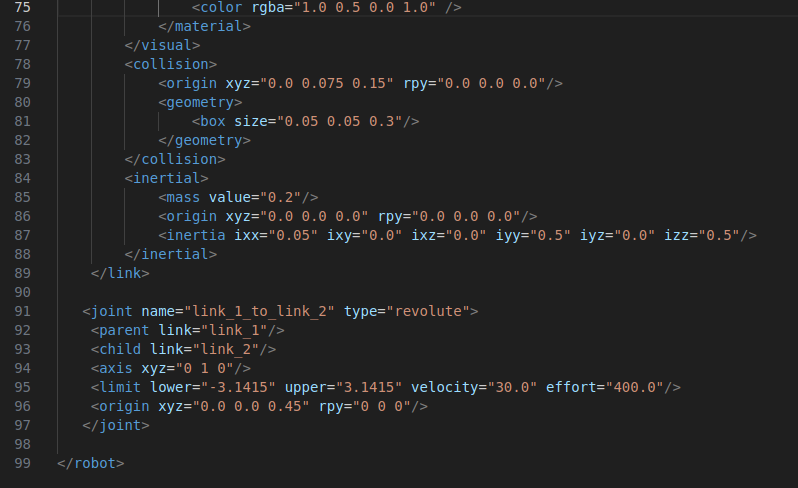

Figura 10. Parámetros de collision.

Si queremos realizar una simulación para visualizar el comportamiento de nuestro robot, se hace uso de RVIZ (Robot Visualization) para ello vamos a guardar lo modificado en VS code, y procedemos a pasarnos a la máquina virtual, en ella vamos agregar los códigos que se muestran en la *Figura 11*, el cual muestra la compilación y la gestión de cambios realizados en los directorios, por último ingresamos el código con terminación xml, y posteriormente se toma unos minutos en abrir el apartado de RVIZ.

  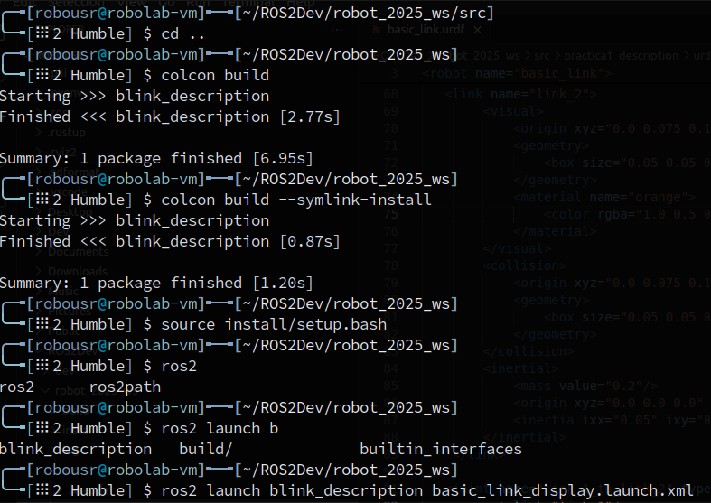

Figura 11. Código para inicializar RVIZ.

Una vez estando en el interface de RVIZ, nos podemos percatar que nos arroja una alerta de que esta erróneo y para ello procedemos a configurarlo, y en primer lugar en la parte de Frixed Frame se ajusta a base_link, con ello el error desaparecerá, todo esto mencionado se puede visualizar en la *Figura 12*.

  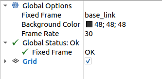

Figura 12. Configuración del interface de RVIZ.

Continuando con la configuración en la parte de create visualization se baja en las opciones que se tiene y se selecciona la opción de RobotModel y le damos Ok. Esto se puede visualizar en la *Figura 13*.

  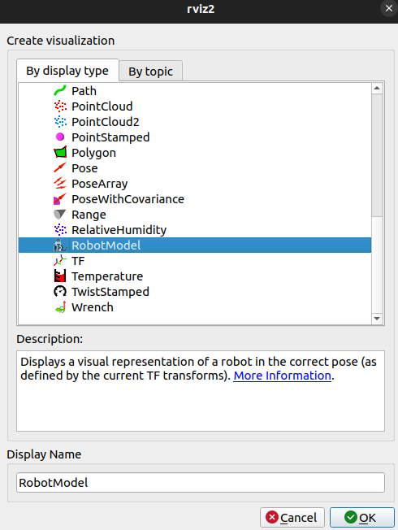

Figura 13. Configuración de create visualization.

Por último queda seleccionar File, en la parte de Description Source, y en la parte de Description File, se selecciona la ruta del documento de URDF el cual tiene el código tanto para un eslabón como para dos eslabones, y una vez seleccionado, en la pantalla se podrá visualizar el comportamiento del robot y con ello podemos ver si se aprecia lo que realmente se esperaba o se deben hacer modificaciones.

  

Figura 14. Visualización de los eslabones en RVIZ.

## Resultados

Una vez realizdo el desarrollo, primeramente para un eslabón y posteriormente para dos eslabones, y con ayuda de RVIZ (Robot Visualization), logramos apreciar la simulación de las líneas de código presentadas anteriormente, para lo cual el resultado obtenido es el siguiente:

- *Simulación para un eslabón*

  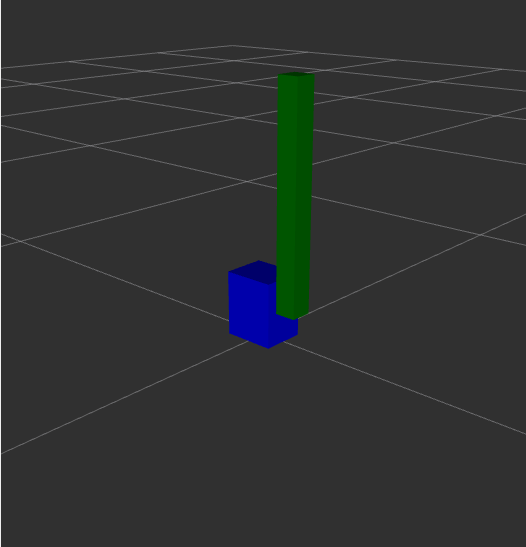

Figura 15. Resultado de un eslabón.

- *Simulación para dos eslabones*

  

Figura 16. Resultado de dos eslabones.

## Conclusión

La práctica realizada me ha permitido adquirir una comprensión profunda acerca de los archivos URDF, y como es que puedo modificar estos, debido a que mi conocimiento no era muy amplio, a su vez he logrado interpretar cómo se estructura la información de los enlaces y juntas, además de lo importante que es la interacción de estos para poder definir el comportamiento del robot. Además, la experiencia práctica de agregar y modificar eslabones y juntas me dio una visión más clara sobre la importancia de materias como cinemática y dinámica en el diseño de un robot. Es muy importante tener la representación en simulaciones, como lo ofrece RVIZ, ya que se pueden hacer correcciones o mejoras antes de implementarlas en robots físicos, finalmente, puedo decir que el objetivo planteado se cumplió de manera satisfactoria.

## Autor

**Autor:** Partida Sánchez Sebastian Yael. [GitHub profile](https://github.com/Yaelee)

## Referencias

[^1]: S. Cousins, "Exponential growth of ROS," IEEE Robotics & Automation Magazine, vol. 18, no. 1, pp. 19-20, March 2011.

[^2]: M. Quigley et al., "ROS: an open-source Robot Operating System," in ICRA Workshop on Open Source Software, vol. 3, no. 3.2, pp. 5-10, 2009.

[^3]: T. O'Kane, "Introduction to Robot Operating System 2 (ROS2)," in Proceedings of the IEEE Conference on Intelligent Transportation Systems, pp. 612-617, 2021

[^4]: M. Otte, N. Correll, and M. A. Goodrich, "Using RVIZ for robotic visualization and multi-robot coordination," Journal of Field Robotics, vol. 27, no. 5, pp. 707-719, 2010.
